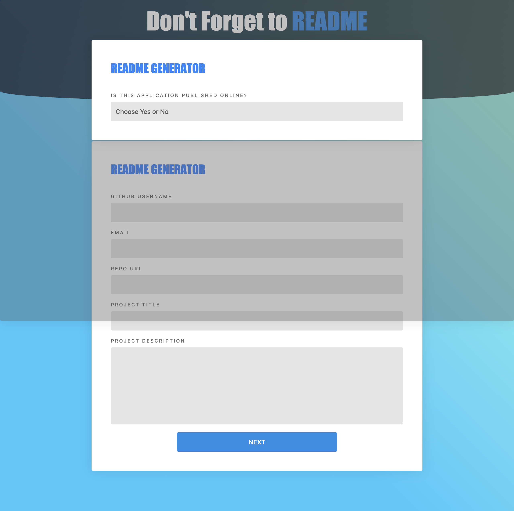

# React App - README.md File Generator

This is a project built with React that allows users to create consistent documentation for projects

## Table of contents

- [Overview](#overview)
- [The challenge](#the-challenge)
- [Screenshot](#screenshot)
- [Links](#links)
- [My process](#my-process)
- [Built with](#built-with)
- [What I learned](#what-i-learned)
- [Continued development](#continued-development)
- [Useful resources](#useful-resources)
- [Author](#author)

## Overview

### The challenge

The user should be able to:

- Enter the information specified in the available fields and generate a README.md file for download

The app should be able to:

- Receive and store information about the users application from the specified fields in object format
- Send JSON obect to the the backend server where object data is transfered to the markdown template
- Generate a README.md file from the markdown tempelate stored in an output directory
- Allow user to download the README.md file to thier computer

### Screenshot



### Links

- GitHub URL: [GitHub URL here](https://github.com/brianlfarmerllc/React_PWA_ReadMeFormatter)
- Live Site URL: [Live site URL here](https://readme-creator.herokuapp.com/)

## My process

### Built with

- Express.Js
- React.Js
- DownloadJS
- React Router Dom and History
- State Management with React Hooks
- Node.Js
- Semantic HTML5 markup
- CSS3 Styling
- Bootstrap 4
- Axios
- JSX Functionality

### What I learned

This was an idea born from a Node.js CLI project that I did in bootcamp using Inquirer.js. I wanted to take it a step further by eleminating the CLI, and creating a React App GUI. It was a practice in working with React, state management, server intergration, and something new, the ability to download a file from a server using the GUI.

I knew how to create a file from the previous project using express.js and a few built in tools like fs, router and, path. And I found that there was a built in download method for the response object to handle the backend serving of the file.

```js
router.route("/createfile").post((req, res) => {
  const OUTPUT_DIR = path.resolve(__dirname, "../output");
  const outputPath = path.join(OUTPUT_DIR, "README.md");

  if (!fs.existsSync(OUTPUT_DIR)) {
    fs.mkdirSync(OUTPUT_DIR);
  }

  fs.writeFile(outputPath, generateMarkdown(req.body), (err) => {
    if (err) {
      return console.log(err);
    }
  });

  return res.json({});
});

router.route("/download").get((req, res) => {
  // built in download method for the response object to handle the backend serving of the file.
  res.download("./output/README.md", "README.md", (err) => {
    if (err) {
      return console.log(err);
    }
  });
});
```

To handle the client side file downloading I found a tool called Download.js that allowed me to import the download function and use it to handle the file sent from the server in the response object.

```js
import download from "downloadjs";

function handleSubmit(event) {
  event.preventDefault();
  API.download()
    .then((res) => {
      // using the download function to handle the file in the response object
      download(res.data, "README.md");
      setForm(initalForm);
      setModal(true);
      setPublished("");
      history.replace(from);
    })
    .catch((err) => {
      console.error(err);
    });
}
```

### Continued development

I think this is a project I can have fun editing as my README.md files change. Adapting the form fields and and template design to handle an evolving format. Will also be good practice in branch management in order to keep the working file intact while creating a new format.

### Useful resources

- [Express res.download](http://expressjs.com/en/api.html#res.download) - Good resourse to read about not only the download method but all the methods in the req and res object.
- [Download.Js](https://www.npmjs.com/package/downloadjs) - NPM for Download.JS Great tool and easy to use.

## Author

- Website - [Brian Farmer](https://brianlfarmerllc-biosite.netlify.app/)
- GitHub URL: - [GitHub URL](https://github.com/brianlfarmerllc)
